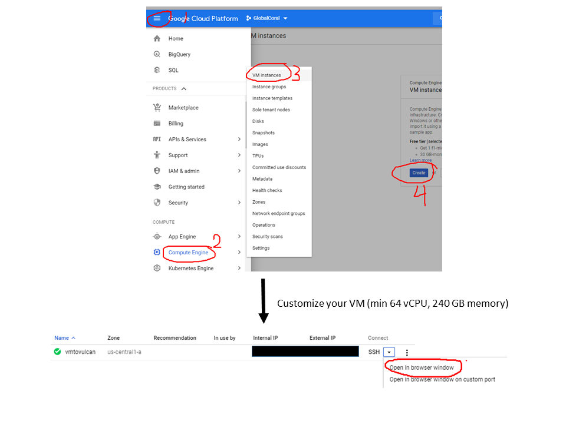

# **Repository to support Allen Coral Atlas (ACA)**

This repository contain code to process [ACA](https://allencoralatlas.org/) planet data.

The scripts above were developed to build mosaics from Planet quads delivered in the Vulcan bucket. They are bassically python wrappers 
for [gdal tools](https://gdal.org/) and meant to be run in a linux environment (High Performance 
computer (HPC) or a virtual machines in cloud computing platforms (e.g. [Google Cloud](https://cloud.google.com/)))

| Script        | Purpose           |
|:------------- |:-------------|  
|mosaic_depth.py|Build mosaic from depth and bottom reflectance quads| 
|mosaic_surfaceReflectance.py|Build mosaic from surface reflectance quads|  
|gdalcalcstats.py|Calculate stats and pyramids efficiently for big raster|

### **How to run scripts in a virtual machine (VM) in Google Cloud Platform**

Assuming that you've got an account in the Google Cloud Platform 
(if not follow [this](https://cloud.google.com/billing/docs/how-to/manage-billing-account))
and you created a project (if not follow
 [this](https://cloud.google.com/resource-manager/docs/creating-managing-projects)), next step 
 is to create a google cloud instance (i.e. Linux virtual machine) 
 ([see details here](https://cloud.google.com/compute/docs/quickstart-linux) and 
 [here](https://cloud.google.com/compute/docs/instances/create-start-instance)). For a more general documentation
 about virtual machines (see [this](https://cloud.google.com/compute/docs/instances/)). Figure below
 show the sequence from creating to start a VM 
 
 
 
 
 
 
 Due to the amount of data to be mosaicked and my experience using the HPC for running the code, 
 the virtual machine should have minimum 64 vCPU, 240 GB memory but the higher computer power
 the better, be of course mindful to turn off your virtual machine when not in use to avoid being 
 extra charged :sob:
 
 
 
 
  
 
 